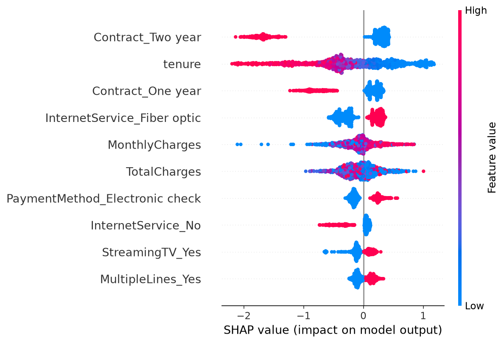
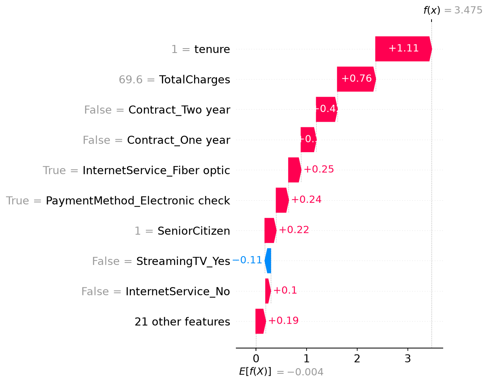

# Churn Prediction : Telco

## Problème business
Quels clients vont quitter l'entreprise, pourquoi, et que faire pour les retenir ?

## Données
Telco Customer Churn (IBM, Kaggle) : 7 043 clients, 21 variables.
Nettoyage : 11 lignes supprimées (TotalCharges vide, clients à tenure = 0).
Taux de churn : 26,5 % (classes déséquilibrées).

## Méthode
EDA → one-hot encoding → Régression Logistique, Random Forest, XGBoost → SHAP.
Split 80/20 stratifié (5 625 train / 1 407 test).

## Résultats
| Modèle | Recall | Precision | AUC |
|---|---|---|---|
| Régression Logistique | 0.80 | 0.49 | 0.835 |
| Random Forest | 0.66 | 0.56 | 0.821 |
| XGBoost | 0.78 | 0.49 | 0.834 |

Les trois modèles ont des performances proches (F1 = 0.61). XGBoost a été retenu
pour l'explicabilité avec SHAP (TreeExplainer).

## Segmentation du risque (XGBoost, jeu de test)
| Segment | Clients | Churn réel |
|---|---|---|
| Faible | 646 | 6,8 % |
| Moyen | 277 | 22,4 % |
| Élevé | 484 | 55,4 % |

Le segment « Élevé » (34 % des clients) concentre environ 72 % des churners.

## Insights clés
1. Contrat mensuel : 42,7 % de churn vs 11,3 % (1 an) et 2,8 % (2 ans).
2. Le churn se concentre dans les premiers mois (médiane 10 mois chez les partants vs 38).
3. Les partants paient plus cher (médiane ~80 vs ~65 par mois).
4. SHAP : les facteurs les plus influents sont le type de contrat, l'ancienneté,
   la fibre optique et le paiement par chèque électronique.

## Recommandations
1. **Contrat** : proposer une offre pour faire passer les clients mensuels à un contrat d'1 an.
2. **Premiers mois** : programme d'accueil pendant les 3 premiers mois.
3. **Fibre optique et chèque électronique** : enquêter sur la satisfaction de ces segments
   et encourager le prélèvement automatique.

## Impact estimé
Hypothèses : perte client 500 DH, offre de rétention 50 DH.
Contacter tous les clients du jeu de test coûterait 70 350 DH ; avec le modèle
(seuil 0.10), le coût estimé est de 54 700 DH (-22 %).
Limite : hypothèse de rétention à 100 % des clients contactés, à affiner.

## Visuels

## Reproduire
pip install -r requirements.txt, télécharger le CSV dans data/, lancer les notebooks.
## Démo en ligne
👉 [Tester l'application](https://churn-prediction-9ovtqfpm55mbzuv9sjzp7e.streamlit.app)